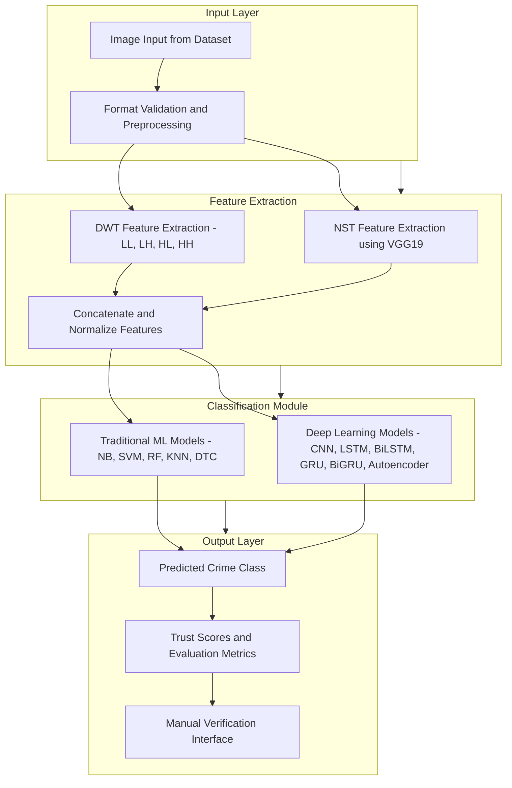

# 🚨 Intelligent Crime Detection  
### A Machine Learning Pipeline using DWT and NST on the UCF-Crime Dataset  

> 🚔 Enhancing forensic investigation through deep learning-based classification of real-world surveillance data.  

---

## 📁 Dataset  

### 🔗 [UCF-Crime Dataset](https://www.kaggle.com/datasets/odins0n/ucf-crime-dataset/data)  
- **Type**: Real-world surveillance dataset  
- **Classes**: 13 anomalous activities including Assault, Burglary, Explosion, Shooting, Vandalism, and more  
- **Samples**:  
  - 🏋️‍♂️ 1.13M+ Training Images  
  - 🧪 98K+ Test Images  
- **Structure**: Each class folder contains frame-wise extracted PNGs from surveillance videos.  

---

## 🎯 Project Objective  

Develop an AI-powered pipeline that:  
- Automatically detects and classifies crime scene elements  
- Uses **Discrete Wavelet Transform (DWT)** for frequency-based texture extraction  
- Applies **Neural Style Transfer (NST)** for content/style decoupling  
- Combines features for training multiple classifiers (ML & DL)  
- Evaluates performance on **11-class classification task**

---

## 🧰 Techniques Used  

### 🔍 Feature Engineering  
- **DWT (Discrete Wavelet Transform)**  
  - Extracts frequency components: LL, LH, HL, HH  
  - Captures texture, edge & spatial data  
- **NST (Neural Style Transfer)**  
  - Utilized **VGG-19**  
  - Enhances pixel segregation  
  - Employs AdaIN, Gram Matrices for stylization  
- Combined features from DWT and NST for model input  

### 🤖 Classifiers Used  
#### ✅ Traditional ML Models  
- Naive Bayes  
- SVM  
- Decision Tree  
- Random Forest  
- K-Nearest Neighbors (KNN)  

#### 🧠 Deep Learning Models  
- ANN, CNN  
- LSTM, BiLSTM  
- GRU, BiGRU  
- Autoencoder  

---

## 🧪 Evaluation Metrics  

| Metric             | Description                                 |
|--------------------|---------------------------------------------|
| Accuracy           | Proportion of correctly predicted instances |
| Precision          | TP / (TP + FP)                              |
| Recall             | TP / (TP + FN)                              |
| F1-Score           | Harmonic mean of precision and recall       |
| Hamming Loss       | Fraction of wrong labels to total labels    |
| Jaccard Score      | Intersection over Union of label sets       |
| MCC (Matthews)     | Balanced measure of quality of prediction   |
| Cohen’s Kappa      | Agreement metric adjusted for chance        |
| Support            | Number of actual occurrences for each label |

---

## 📊 Key Results  

🟢 **Best F1 Score**: Naive Bayes  
🟡 **Best MCC & Kappa**: SVM  
🔵 **Highest Accuracy**: Autoencoder  

---

## ⚙️ System Architecture  

       
## 🌱 Future Scope

- Integration with live CCTV feeds
- Explainable AI for forensic trustability
- Augmented Reality overlays for crime scene visualization
- Multimodal fusion (thermal + RGB + depth)
- Advanced models like Transformers and Diffusion Models
